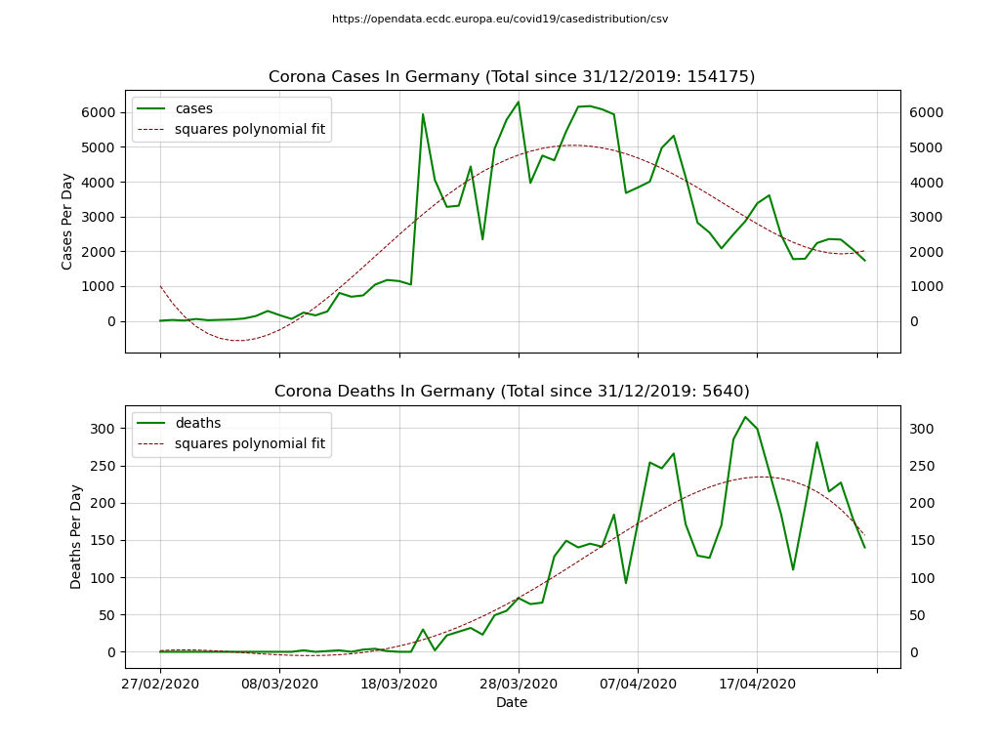
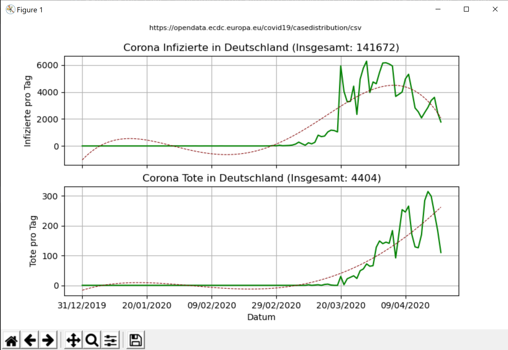

# Welcome to the Python based visualization for covid19 data

## Purpose

Also I have used the RSS feed from RKI I always have been
seeing the snapshot of the day only and I were interested
to the see the development from the past weeks and months
until now for my own country.

The final result looks like this:



## Quickstart

The whole thing is written in Python 3. You require to have some
libraries installed:

```
pip install requests numpy pandas matplotlib
```

With this you simply can run the script like this:

```
python visualize.py
```

Running this script a file **covid19.csv** is generated and
a file **covid19.png** is generated. In addition the viewer
is started showing you the results:



## Links

 - https://opendata.ecdc.europa.eu/covid19/casedistribution/csv
 - https://www.rki.de/SiteGlobals/Functions/RSSFeed/RSSGenerator_nCoV.xml
 - Used libraries (documention in this repository) [here](docs/pandas-and-friends.md)
