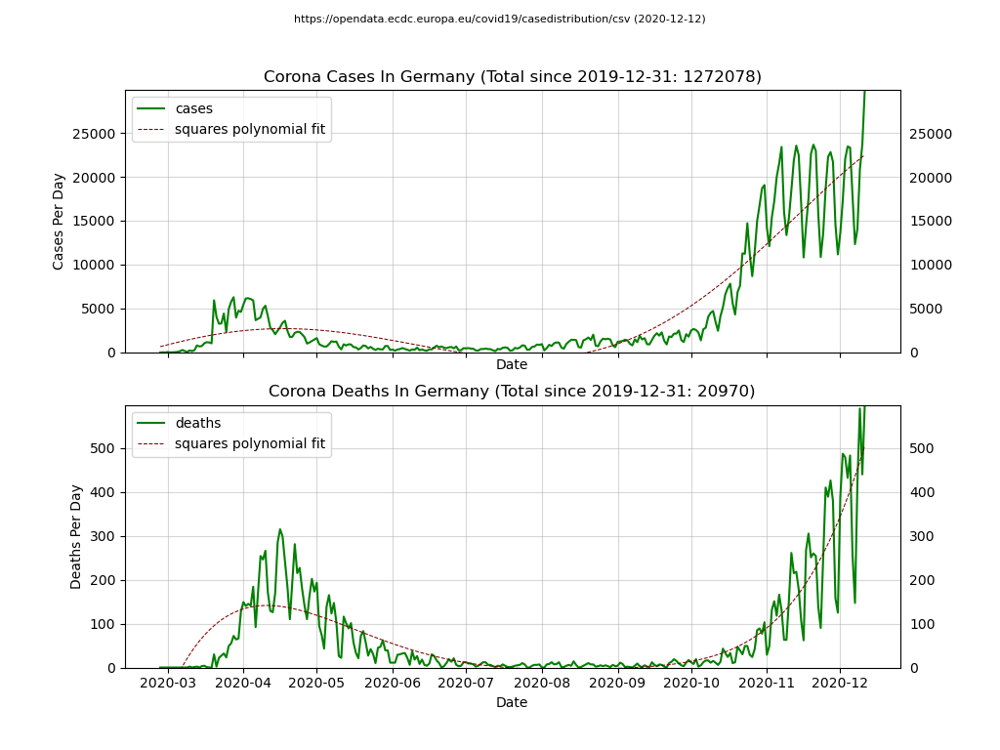
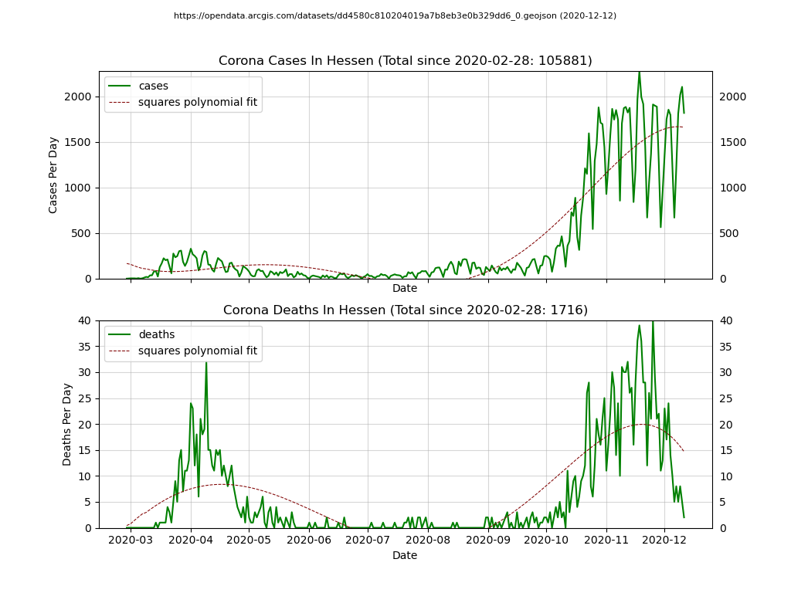

# Welcome to the Python based visualization for covid19 data

[](https://travis-ci.org/Nachtfeuer/covid19)

## Purpose

Also I have used the RSS feed from RKI I always have been
seeing the snapshot of the day only and I were interested
to the see the development from the past weeks and months
until now for my own country (as default).

The final result looks like this (depending on the options you have choosen):



and




## Quickstart for countries in the world

The whole thing is written in Python 3. You require to have some
libraries installed:

```
pip install requests numpy pandas matplotlib click
```

With this you simply can run the script like following (depending on the options you have choosen):

```
python visualize.py --country=germany
```

Running this script a file **covid19-germany.png** is generated
(you can generate for other countries as well).
In addition the viewer is started showing you same image where you can do some
operation like zooming into the data.


The tool also provides command line options:

```
> python visualize.py --help
Usage: visualize.py [OPTIONS]

  Visualizing covid19 data with matplotlib, panda and numpy.

Options:
  -w, --width INTEGER             Width in pixels for the image.  [default:
                                  1024]
  -h, --height INTEGER            Height in pixels for the image.  [default:
                                  768]
  -c, --country <NAME>            Country as filter for the data (repeatable).
                                  [default: Germany]
  -f, --format [png|svg|jpg]      File format for image (repeatable).
                                  [default: png]
  --viewer / --no-viewer          Show/hide the viewer.  [default: True]
  --initial-cases INTEGER         Ignoring intial cases less than than given
                                  value for visualization (totals are not
                                  affected)  [default: 0]
  --cache / --no-cache            Enable/Diable the cache.  [default: False]
  --cache-file <PATH>             Path and filename of the cache file.
                                  [default:
                                  D:\Programmierung\covid19\covid19.csv]
  -a, --transparency FLOAT RANGE  Enables transparency for viewer  [default:
                                  0.8]
  --help                          Show this message and exit.
```

Hints:

 - The default for cache file looks (of course) on your machine differently.
 - you can define **--country=all** to the see aggregated data for
   all countries.
 - The **--format** parameter is repeatable; you can generate multiple output formats
 - The **--country** parameter is repeatable; you can generate multiple images per
   defined country. If you specify more than one countr the viewer is disabled for
   the moment (issue #17 will resolve this soon).
 - The initial cases is to hide the relative flat line at the beginning.
   However the totals shown are still for the whole data.
   I'm using --initial-cases=4 for the images.
 - When using the viewer each country is shown in a separate tab.

# Quickstart for Bundesländer in Germany

The whole thing is written in Python 3. You require to have some
libraries installed:

```
pip install requests numpy pandas matplotlib click
```

With this you simply can run the script like following (depending on the options you have choosen):

```
python visualize-germany.py --filter=hessen
```

Running this script  a file **covid19-germany-hessen.png** is generated
(you can generate for other Bundesländer as well).
( a viewer is not yet added, but will come soon)


The tool also provides command line options:

```
> python visualize-germany.py --help
Usage: visualize-germany.py [OPTIONS]

  Visualizing covid19 data with matplotlib, panda and numpy.

Options:
  --cache / --no-cache        Enable/Diable the cache.  [default: False]
  --cache-file <PATH>         Path and filename of the cache file.  [default:
                              D:\Programmierung\covid19\covid19-germany.json]
  --filter-by <NAME>          value of the filter for the data  [default:
                              bundesland]
  -f, --filter <NAME>         value of the filter for the data (repeatable).
                              [default: ]
  --initial-cases INTEGER     Ignoring intial cases less than than given value
                              for visualization (totals are not affected)
                              [default: 0]
  -w, --width INTEGER         Width in pixels for the image.  [default: 1024]
  -h, --height INTEGER        Height in pixels for the image.  [default: 768]
  -f, --format [png|svg|jpg]  File format for image (repeatable).  [default:
                              png]
  --help                      Show this message and exit.
```


Hints:

 - The default for cache file looks (of course) on your machine differently.
 - you can define **--filter=all** to the see aggregated data for
   all Bundesländer.
 - The **--format** parameter is repeatable; you can generate multiple output formats
 - The **--filter** parameter is repeatable; you can generate multiple images per
   defined country.
 - The initial cases is to hide the relative flat line at the beginning.
   However the totals shown are still for the whole data.

## Links

 - https://opendata.ecdc.europa.eu/covid19/casedistribution/csv
 - https://www.rki.de/SiteGlobals/Functions/RSSFeed/RSSGenerator_nCoV.xml
 - Used libraries (documention in this repository) [here](docs/pandas-and-friends.md)

