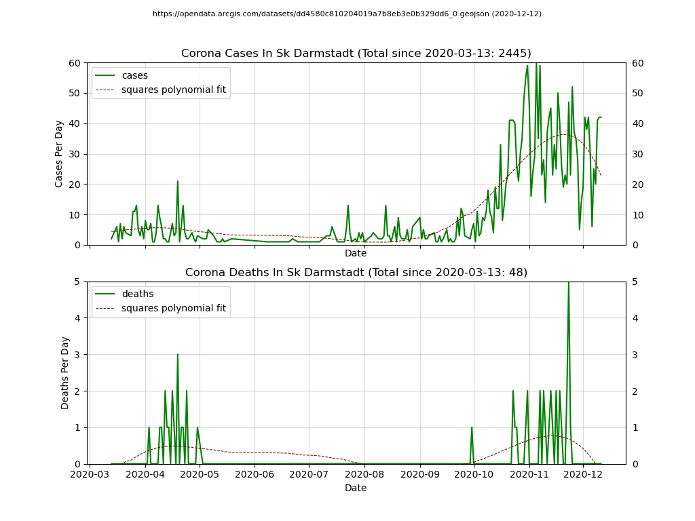

# Welcome

I'm trying to update those images more often but it's not guaranteed.
You can use the tool to view the details for the "Bundesland" in Germany
you are interested in or just create the images.`

**Example:**

```
python ..\..\..\visualize-germany.py --cache --filter=bayern --filter=hessen
```

**Please note**: You have to remove the JSON to update the cache.


You also can use the filter on "Landkreis":

**Example:**

```
python ..\..\..\visualize-germany.py --cache --filter=landkreis --filter="SK Darmstadt"
```

**Please note**: You have to remove the JSON to update the cache.


